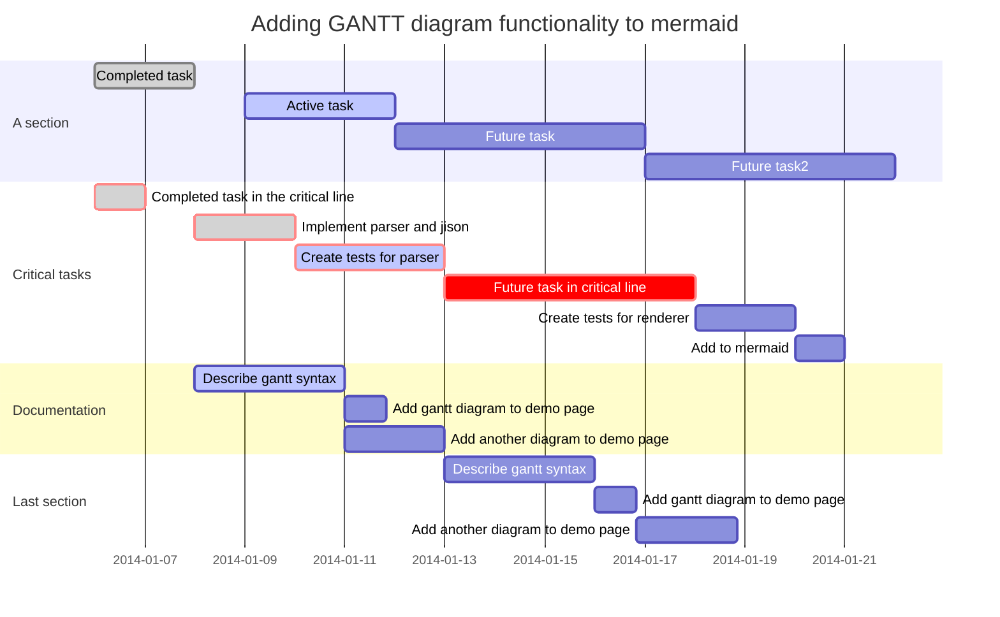

# RPC Protocol
Stand for **R**emote **P**rocedure **C**all; Remote Procedure Call (RPC) is a powerful technique for constructing distributed, client-server based applications. It is based on extending the conventional local procedure calling so that the called procedure need not exist in the same address space as the calling procedure. The two processes may be on the same system, or they may be on different systems with a network connecting them. 

[More about this Protocol](https://www.geeksforgeeks.org/remote-procedure-call-rpc-in-operating-system/)

# DNS
Stand for **D**omain **N**ame **S**ystem, is like the phone book of the internet . it maps human readable urls or hostname like:
www.fireship.io -----------------------------------------> 172.16.254.1

